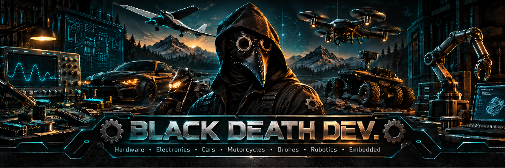

  

 
 
 

**Hardware enthusiast, tinkerer, and creator of questionable engineering projects.**  
*Любитель железа, электроники и сомнительных инженерных проектов.*

I build, repair, modify, reverse-engineer, and experiment with electronics, cars, motorcycles, drones, robots, embedded systems — and pretty much anything interesting enough to take apart.

*Собираю, ремонтирую, переделываю и исследую электронику, автомобили, мотоциклы, дроны, роботов, embedded-системы и вообще всё, что выглядит достаточно интересно, чтобы это разобрать.*

Projects involve **AI, soldering, oscilloscopes, improvisation, a few carefully engineered kludges — and occasionally a burned MOSFET.** 😄

*В проектах участвуют **ИИ, пайка, осциллографы, импровизация, несколько тщательно спроектированных костылей — и иногда сгоревший MOSFET.*** 😄

---

## 🧰 What I'm into / Чем занимаюсь

### ⚡ Electronics / Электроника
Circuits, soldering, diagnostics, sensors, power electronics, microcontrollers and hardware debugging.

*Схемы, пайка, диагностика, датчики, силовая электроника, микроконтроллеры и поиск аппаратных неисправностей.*

### 🚗 Cars & Motorcycles / Авто и мотоциклы
Diagnostics, repair, electrical systems, modifications and garage engineering.

*Диагностика, ремонт, электрика, доработки и классическая гаражная инженерия.*

### 🚁 Drones, RC & Robotics / Дроны, RC и робототехника
Quadcopters, fixed-wing aircraft, robotic platforms, telemetry, sensors and control systems.

*Квадрокоптеры, самолёты, роботизированные платформы, телеметрия, датчики и системы управления.*

### 🔬 Embedded & Reverse Engineering / Embedded и реверс-инжиниринг
UART, SPI, I²C, firmware experiments, programmers, unknown boards, undocumented interfaces and signal tracing.

*UART, SPI, I²C, прошивки, программаторы, неизвестные платы, недокументированные интерфейсы и трассировка сигналов.*

### 💻 Pragmatic Coding / Практическое программирование
I'm not a professional software engineer — I write software because sooner or later the hardware needs someone to tell it what to do.

AI helps. Documentation helps. Debugging helps.

And when nothing else works — there is always a strategically placed **костыль**.

*Я не профессиональный программист. Код для меня — ещё один инструмент, который заставляет железо делать то, что мне нужно.*

---

## 🚀 Featured Project / Главный проект

### Bluetooth UART Configurator

A cross-platform utility for configuring Bluetooth UART modules such as **HC-05, HC-06, JDY** and similar devices.

*Кроссплатформенная утилита для настройки Bluetooth UART-модулей.*

Features:

- automatic baud-rate detection;
- module-specific AT-command handling;
- Windows support;
- Android support via USB OTG.

Because configuring a $2 Bluetooth module shouldn't require an archaeological expedition through 15 years of forum posts.

*Потому что настройка Bluetooth-модуля за 2$ не должна превращаться в 15-летнюю археологическую экспедицию по старым форумам.*

---

## 🔧 Workshop Philosophy / Философия мастерской

> **If it works — understand why.**  
> **If it doesn't — take it apart.**  
> **If it starts smoking — now you know where the problem is.**

> **Если работает — разберись почему.**  
> **Если не работает — разбери.**  
> **Если задымилось — теперь хотя бы понятно, где проблема.**

---

## 🍺 Support the Magic Smoke / Поддержать мастерскую

If you'd like to support future projects — or help replace the next MOSFET that achieves spontaneous thermal enlightenment — thank you. 😄

*Если хотите поддержать будущие проекты — или помочь заменить следующий MOSFET, достигший теплового просветления — спасибо.*

- ☕ **Ko-fi:** [ko-fi.com/kddex](https://ko-fi.com/kddex)
- 🍺 **Boosty:** [boosty.to/kddex](https://boosty.to/kddex)

---

  <b>☣️ BLACK DEATH DEV. ☣️</b>  
  <i>May your ideas work and your MOSFETs stay cool.</i> 
  <i>Пусть идеи работают, а MOSFET-ы остаются холодными.</i>

